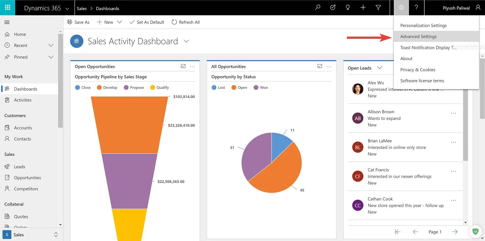
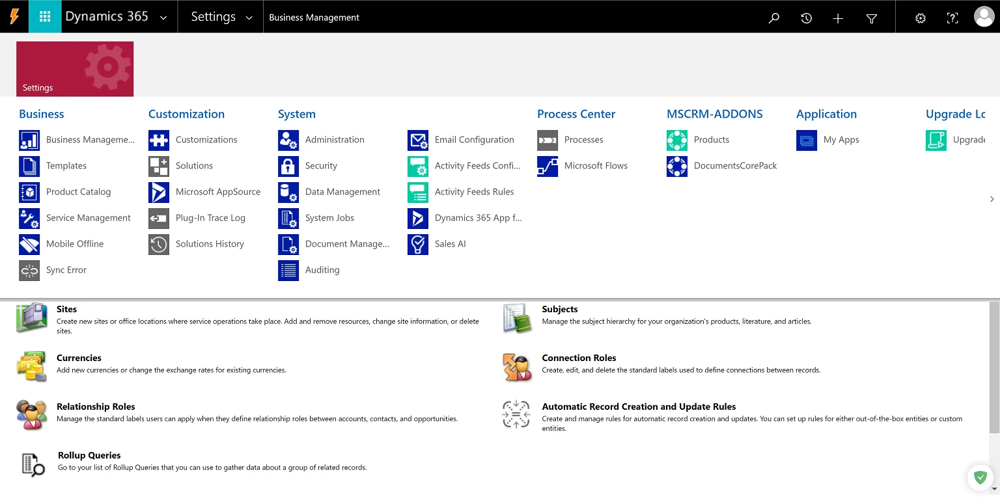

As the title suggests, you either love what Microsoft is doing with its new Unified Interface for Dynamics 365 or you absolutely hate it, but you cannot ignore it, not if you have recently subscribed for a trial instance of Dynamics 365.

It came in as a surprise to me when I recently created a trial instance. Previously, if you wanted to go to the classic interface of Dynamcics 365, you would simple choose the *Dynamics 365 - custom* app, but things have changed. I tried logging in to classic interface but couldn't get on to it and noticed a new flag in the URL
`https://xxx.crm.dynamics.com/main.aspx?app=xxxdefault&forceUCI=1`

Notice the two flags
* `app = xxxdefault` This tells which app should be opened, usually you would see a GUID listed here
* `forceUCI = 1` This is the flag which force you to the Unified Interface

If you ask me, I love the new interface and the efforts that have gone into building it. Looks much cleaner and good usage of real estate. However, it was bit of a struggle for me when I realized that there was no `Settings` tab avialable in the Unified Interface.

### How do I reach the Settings Tab in Unified Interface
This is currently hidden in the little wrench icon on the top right corner of the app with the title **Advanced Settings**

This will take you to the settings screen where you can proceed with customizing Dynamics 365. The sitemap is restricted to only show you `settings` here. The URL is similar to the one below
`https://xxx.crm.dynamics.com/main.aspx?settingsonly=true`

Let me know your thoughts if this is a welcome change for you!